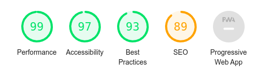
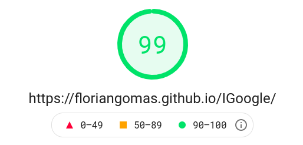
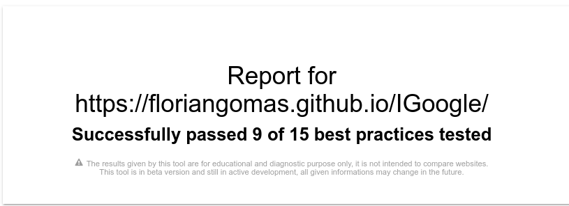

# Rendu IGoogle

## IMPORTANT

Pour pouvoir utiliser l'API météo il faut autoriser le contenu non sécurisé. Sous Chromium faire un clic droit sur le cadenas à gauche de l'url et sélectionner site settings. En bas de la liste des options autorisé le contenu non sécurisé : 

* insecure content => Allow

L'API news ne fonctionne pas en contenu non sécurisé, elle est payante pour être utilisé en HTTPS. Elle ne fonctionnera donc pas sur la version déployée du site. Il faudra pour la tester récupérer le code sur GitHub et  lancer le site en localhost.

Le site n'est pas responsive

## Fonctionnalités

L'utilisateur peut ouvrir plusieurs widget en cliquant sur leurs noms dans la barre de navigation :

* Météo : Ouvre une fenêtre permettant à l'utilisateur de saisir le nom de la ville dont il veut la météo.

* Date :  Ouvre une fenêtre qui affiche la date et l'heure système en temps réél

* Photos : Ouvre une fenêtre qui permet à l'utilisateur d'afficher une photo en fonction du mot saisi

* Twitter : Ouvre une fenêtre qui affiche le fil Twitter de Michel Billaud

* News :  Ouvre une fenêtre qui permet d'afficher les 5 premières news en fonction du themes choisi

* Couleurs : Permet de modifier la couleur des widgets, la couleur de la police s'adaptera de manière à être la plus contrasté possible

Chaque fenêtre peut être déplacée par l'utilisateur sur la page comme il le souhaite.

La search bar permet d'effectuer n'importe quelle recherche, un nouvel onglet s'ouvre avec le résultat de la recherche (moteur de recherche utilisé : Ecosia).

Il est impossible d'ouvrir plusieurs fois le même widget.

##  Performances

J'ai testé les performances du site avec plusieurs outils :

* Audit Chrome

* Page Speed Insights

  

* Econometer

  